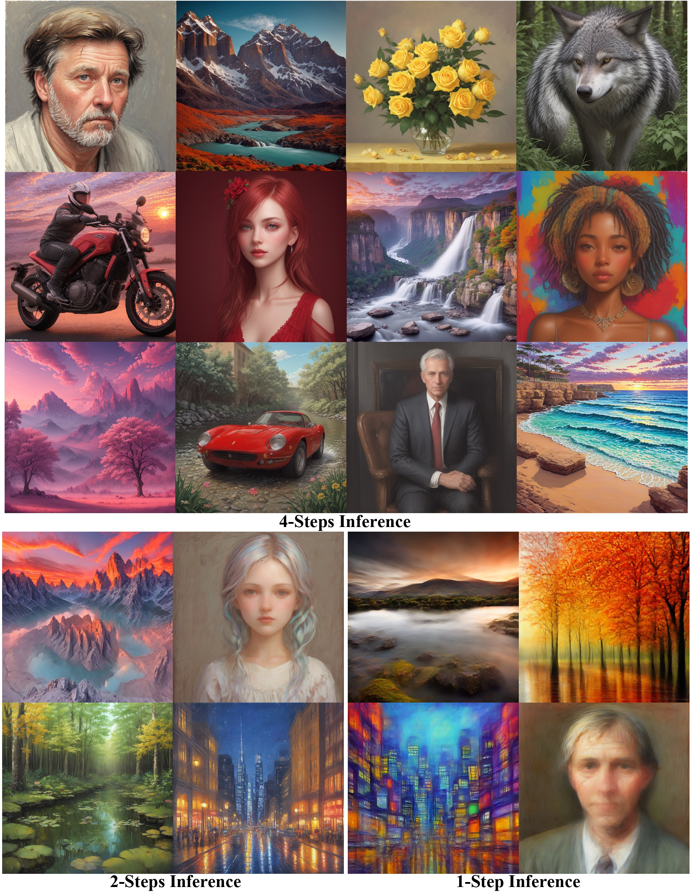
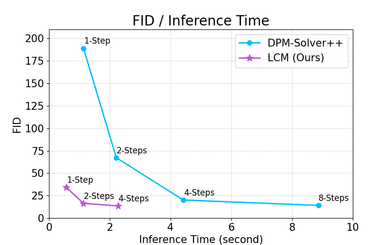

# Latent Consistency Models

Official Repository of the paper: *[Latent Consistency Models: Synthesizing High-Resolution Images with Few-Step Inference](https://arxiv.org/abs/2310.04378)*.

Project Page: https://latent-consistency-models.github.io

Try our 🤗 Hugging Face Demos: [](https://huggingface.co/spaces/SimianLuo/Latent_Consistency_Model) 🔥🔥🔥

Replicate Demo: [](https://replicate.com/cjwbw/latent-consistency-model) 

 Join our LCM discord channels <a href="https://discord.gg/tKuDcPH8" style="text-decoration:none;">
    </a> for discussions. Coders are welcome to contribute.

## News
- (🔥New) 2023/10/25 We have official [**LCM Pipeline**](https://github.com/huggingface/diffusers/tree/main/src/diffusers/pipelines/latent_consistency_models) and [**LCM Scheduler**](https://github.com/huggingface/diffusers/blob/main/src/diffusers/schedulers/scheduling_lcm.py) in 🧨 Diffusers library now! Check the new "Usage".
- (🔥New) 2023/10/24 Simple **Streamlit UI** for local use: See the [link](https://github.com/akx/lcm_test) Thanks for [@akx](https://github.com/akx).
- (🔥New) 2023/10/24 We support **SD-Webui** and **ComfyUI** now!! Thanks for [@0xbitches](https://github.com/0xbitches). See the link: [SD-Webui](https://github.com/0xbitches/sd-webui-lcm) and [ComfyUI](https://github.com/0xbitches/ComfyUI-LCM). 
- (🔥New) 2023/10/23 Running on **Windows/Linux CPU** is also supported! Thanks for [@rupeshs](https://github.com/rupeshs) See the [link](https://github.com/rupeshs/fastsdcpu).
- (🔥New) 2023/10/22 **Google Colab** is supported now. Thanks for [@camenduru](https://github.com/camenduru/stable-diffusion-webui-colab) See the link: [Colab](https://github.com/camenduru/stable-diffusion-webui-colab/blob/main/special/stable/lcm_dreamshaper_v7_webui_colab.ipynb)
- (🔥New) 2023/10/21 We support **local gradio demo** now. LCM can run locally!! Please refer to the "**Local gradio Demos**".
- (🔥New) 2023/10/19 We provide a demo of LCM in 🤗 Hugging Face Space. Try it [here](https://huggingface.co/spaces/SimianLuo/Latent_Consistency_Model).
- (🔥New) 2023/10/19 We provide the LCM model (Dreamshaper_v7) in 🤗 Hugging Face. Download [here](https://huggingface.co/SimianLuo/LCM_Dreamshaper_v7).
- (🔥New) 2023/10/19 LCM is integrated in 🧨 Diffusers library. Please refer to the "Usage".

## 🔥 Local gradio Demos:
To run the model locally, you can download the "local_gradio" folder:
1. Install Pytorch (CUDA). MacOS system can download the "MPS" version of Pytorch. Please refer to: [https://pytorch.org](https://pytorch.org)
2. Install the main library:
```
pip install diffusers transformers accelerate gradio==3.48.0 
```
3. Launch the gradio: (For MacOS users, need to set the device="mps" in app.py)
```
python app.py
```

## Demos & Models Released
Ours Hugging Face Demo and Model are released ! Latent Consistency Models are supported in 🧨 [diffusers](https://github.com/huggingface/diffusers). 

LCM Model Download: [LCM_Dreamshaper_v7](https://huggingface.co/SimianLuo/LCM_Dreamshaper_v7)

Hugging Face Demo: [](https://huggingface.co/spaces/SimianLuo/Latent_Consistency_Model)

Replicate Demo: [](https://replicate.com/cjwbw/latent-consistency-model) 

OpenXLab Demo: [](https://openxlab.org.cn/apps/detail/Latent-Consistency-Model/Latent-Consistency-Model)

Tungsten Demo: [](https://tungsten.run/mjpyeon/lcm)

Novita.AI Demo:  [](https://novita.ai/product/lcm-txt2img)


<p align="center">
    
</p>

By distilling classifier-free guidance into the model's input, LCM can generate high-quality images in very short inference time. We compare the inference time at the setting of 768 x 768 resolution, CFG scale w=8, batchsize=4, using a A800 GPU. 

<p align="center">
    
</p>


## Usage
We have official [**LCM Pipeline**](https://github.com/huggingface/diffusers/tree/main/src/diffusers/pipelines/latent_consistency_models) and [**LCM Scheduler**](https://github.com/huggingface/diffusers/blob/main/src/diffusers/schedulers/scheduling_lcm.py) in 🧨 Diffusers library now! The older usages will be deprecated.
But you can still use the older usages by adding ```revision="fb9c5d1"``` from ```from_pretrained(...)``` 

You can try out Latency Consistency Models directly on:
[](https://huggingface.co/spaces/SimianLuo/Latent_Consistency_Model)

To run the model yourself, you can leverage the 🧨 Diffusers library:
1. Install the library:
```
pip install diffusers transformers accelerate
```

2. Run the model:
```py
from diffusers import DiffusionPipeline
import torch

pipe = DiffusionPipeline.from_pretrained("SimianLuo/LCM_Dreamshaper_v7", custom_pipeline="latent_consistency_txt2img", custom_revision="main", revision="fb9c5d")

# To save GPU memory, torch.float16 can be used, but it may compromise image quality.
pipe.to(torch_device="cuda", torch_dtype=torch.float32)

prompt = "Self-portrait oil painting, a beautiful cyborg with golden hair, 8k"

# Can be set to 1~50 steps. LCM support fast inference even <= 4 steps. Recommend: 1~8 steps.
num_inference_steps = 4 

images = pipe(prompt=prompt, num_inference_steps=num_inference_steps, guidance_scale=8.0, lcm_origin_steps=50, output_type="pil").images
```

## BibTeX

```bibtex
@misc{luo2023latent,
      title={Latent Consistency Models: Synthesizing High-Resolution Images with Few-Step Inference}, 
      author={Simian Luo and Yiqin Tan and Longbo Huang and Jian Li and Hang Zhao},
      year={2023},
      eprint={2310.04378},
      archivePrefix={arXiv},
      primaryClass={cs.CV}
}
```
